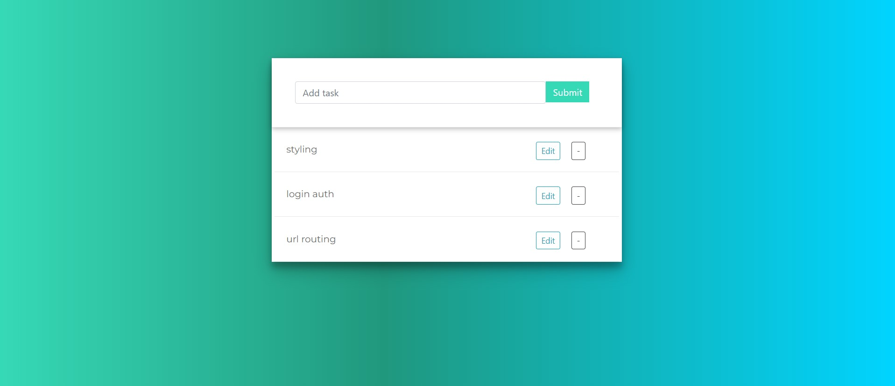

# ToDo-App
This is my submission on the Jumping Minds Problem statement.

# Problem Statement
The project involves the building of a todo application. In a todo app, a user can keep track of all the things he/she is planning to do and create a list. They can then update the list when the task is completed. Build a nice app with basic Html, CSS, and JavaScript and host on the localhost server using Django or Flask framework.


# Approach
A ToDo app is somethig that helps people remind what work is left for them to do. I wanted to Create something that is minimal and also something that will let me learn the CRUD Functionalities using Django REST Frame work.And Thus taking help from the resources available around i made the Following ToDo app.
<ul>
<li>My Web app Contains all the CRUD actions. I have connected my front end and Back end using the Fetch API for Responses.</li>
    <ul>
    <li>The user can add his Todo item usinf the task bar above</li>
    <li>He or she can also Strike Untstrike relative to the staus of the work</li>
    <li>There is also and Delete and Edit buttion which can perform the Update and the Delete Function</li>
    </ul>
<li>With Relativly simple UI UX i focused more on providing solution that would solve the base purpose and would be easy to use and good on the eyes.</li>
</ul>

<br>
<p align="center" width="100%">
    <br>
</p>
<br>

# Design Choices.
Here I went for a relativly simple and clean UI . I used Bootstrap and Javascript for the designing. Also i Created an Unstrike Strike Functionalities that would be easy to understand for the user.

Also i took the white colour , as it woukd give a neat finish to my web app. My design Choices were based on what would make the app as simple and clean as possible and while providing all the neccessary functionalities

# Future Scope.
I would Like to add the following Functionalities in the future.
<ul>
<li>Login Page and Authentication.</li>
<li>Adding a combination of Search and Submit bar.</li>
<li>Providing a Work scheduling and prefrence functionality.</li>
</ul>

## Setup
To run this project locally:
Go to the directory where the project is present

Write this in your Command prompt
```
$ pip install django

$ pip install djangorestframework
```

Then after this in the command prompt and use this command
```
$ python manageserver.py runserver
```
